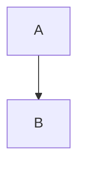

# Markdown 语法效果
**这个是粗体**
*这个是斜体*
***这个是粗体加斜体***~~删除线~~
这里是在线文档的首页，此页面的文件为站点根目录下的 `data/index.md` 文件，可以通过修改此文件来修改本页面。

*地址*

[Markdown语法](https://www.jianshu.com/p/a3786cc10a99#fn1)

<u>带下划线的内容</u>

---

需要注明的文本 [^MarkDown]。

| 左对齐 | 右对齐 | 居中对齐 |
| :-----| ----: | :----: |
| 单元格 | 单元格 | 单元格 |
| 单元格 | 单元格 | 单元格 |

~~~
<a href="#/zh-cn/Quick_Start">中文</a>
~~~

```javascript
    function fun(){
         echo "这是一句非常牛逼的代码";
    }
    fun();
```

<div align=right></div>

[画流程图](https://www.jianshu.com/p/b421cc723da5)

[画流程图2](https://blog.csdn.net/love667767/article/details/90764425#FLowchart_204)



   

