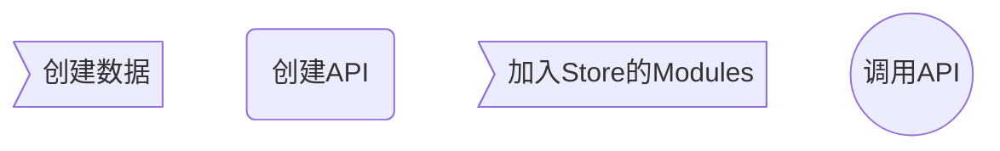

# Mock的使用

 
## 使用mockjs创建数据

> 注意：创建调用API的URL时，需带上前缀 /api/xxx

~~~javascript
// /mock/api/product.js
const Mock = require('mockjs')
const Qs = require('qs')
const Random = Mock.Random

const titleList = ['男士上衣', 'T恤', '衬衫', '牛仔裤', '皮衣', '短裙', '女士衬衫', '长裙', '羽绒服', '秋裤', '军大衣'];

const getProductList = function (params) {
  // 获取全部商品列表或者分页商品列表
  let products = []
  for (let i = 0; i < 100; i++) {
    let product = {
      id: i + 1,
      title: titleList[Math.floor(Math.random()*titleList.length)],
      price: Random.float(10, 100).toFixed(2),
      stock: Random.integer(10, 100),
      saleCount: Random.integer(0, 90),
      isSale: Random.integer(0, 1),
      createTime: Random.datetime(),
      imgUrl: Random.dataImage('60x60', 'ZAdmin-' + (i + 1)),
      showEditButton: true,
      showRemoveButton: true
    }
    products.push(product)
  }

  let total = products.length;
  if (params.body && products.length) {
    let pageInfo = JSON.parse(Qs.parse(params).body);
    let start = (pageInfo.currentPage - 1) * pageInfo.pageSize;
    let end = pageInfo.currentPage * pageInfo.pageSize;
    products = products.slice(start, end);
    console.log(`start: ${start}  end: ${end}  products: ${products}  total: ${total}`);
  }

  return { products, total }
}

// 通过post请求，使用参数的token判断是否登录，并通过参数判断获取全部评论列表或者获取分页评论列表
const getProductComments = function (params) {
  let data = JSON.parse(Qs.parse(params).body);
  console.log('api-comments-params: ', data);
  if (!data.token) {
    return {
      status: 401,
      msg: 'token错误，需要登录',
      data: {}
    }
  }

  let comments = []
  for (let i = 0; i < 120; i++) {
    let comment = {
      id: i + 1,
      name: Random.cname(),
      itemScore: Random.integer(1, 5),
      serviceScore: Random.integer(1, 5),
      content: Random.ctitle(10, 50),
      createTime: Random.datetime(),
      showEditButton: true,
      showRemoveButton: true
    }
    comments.push(comment)
  }

  let total = comments.length;

  if (data.page) {
    let pageInfo = data.page;
    let start = (pageInfo.currentPage - 1) * pageInfo.pageSize;
    let end = pageInfo.currentPage * pageInfo.pageSize;
    comments = comments.slice(start, end);
    console.log(`currentPage: ${pageInfo.currentPage} start: ${start}  end: ${end}  comments: ${comments}  total: ${total}`);
  }

  return {
    status: 0,
    msg: '成功',
    data: comments,
    total: total
  }
}

// 创建API的URL，让vue通过URL获取数据
Mock.mock('/api/products', 'get', getProductList); // 获取所有商品
Mock.mock('/api/products', 'post', getProductList); // 获取分页商品数据
Mock.mock('/api/productComments', 'post', getProductComments)
~~~

## 创建API接口，共VUE项目调用

>注意：引用 plugin/axios 中的 request 方法发起请求 发起请求的URL，不需要带 /api/ 前缀

~~~javascript
// /src/api/pruduct.js
import request from '@/plugin/axios'

export function getProducts (data) {
  return request({
    url: '/products',
    method: 'get',
    data
  })
}

export function getPageProducts (data) {
  return request({
    url: '/products',
    method: 'post',
    data
  })
}

export function getProductComments (data) {
  return request({
    url: '/productComments',
    method: 'post',
    data
  })
}
~~~

## 在 VUEX 中创建API，调用上一步中创建API接口，对数据进行操作

> 注意
<h5>1、在 /src/store/modules/ 下创建操作对象的模块，如 product，其包括了 modules 文件夹和 index.js 文件，index.js 文件复制 \src\store\modules\d2admin\index.js即可</h5>
<h5>2、在modules文件夹下创建 product.js 文件用于调用第二步中创建的 API 接口，并对收到的数据进行操作，文件结构与 VUE 项目中store.js相同</h5>
<h5>3、在 product.js 文件中声明 namespaced: true，加了命名空间操作，将该文件直接加在了product文件夹下，被调用时，中间省去了一层 modules，为 product/product</h5>
<h5>4、调用 API 时，需要先导入提前定义好的 API</h5>
<h5>5、修改 \src\store\index.js 文件，将该模块导出，使 view 能够调用</h5>

~~~javascript
// \src\store\modules\product\modules\product.js
import { getProducts, getPageProducts, getProductComments } from '@/api/product'

export default {
  namespaced: true,
  actions: {
    getProducts ({ commit }, payload) {
      commit('getProducts', payload)
    },

    getPageProducts ({ commit }, payload) {
      commit('getPageProducts', payload)
    },

    getComments ({ commit }, payload) {
      commit('getComments', payload)
    }
  },

  mutations: {
    getProducts (state, payload) {
      state.loading = true;
      getProducts(payload).then(res => {
        console.log('getProducts:  ', res);
        state.loading = false;
        state.products = res.products;
      }).catch( err => {
        console.log('err', err)
        state.loading = false
      })
    },

    getComments (state, payload) {
      // 获取全部评价信息或者分页评价信息
      state.loading = true;
      console.log(payload);
      getProductComments(payload).then(res => {
        console.log('getComments:  ', res);
        if (res.status == 0) {
          state.loading = false;
          state.total = res.total;
          if (payload.page) {
            state.pageComments = res.data;
          } else {
            state.comments = res.data;
          }
        }
      }).catch( err => {
        console.log('err', err)
        state.loading = false
      })
    },

    getPageProducts (state, payload) {
      console.log('page_params: ', payload);
      state.loading = true;
      getPageProducts(payload).then(res => {
        console.log('res:  ', res);
        state.loading = false;
        state.total = res.total;
        state.pageProducts = res.products;
      }).catch( err => {
        console.log('err', err)
        state.loading = false
      })
    }
  },

  state: {
    products: [],
    pageProducts: [],
    comments: [],
    pageComments: [],
    loading: false,
    total: 0
  },

  getters: {
    products: (state) => { return state.products },
    pageProducts: (state) => { return state.pageProducts },
    comments: (state) => { return state.comments },
    pageComments: (state) => { return state.pageComments },
    loading: (state) => { return state.loading },
    total: (state) => { return state.total }
  }
}
// \src\store\index.js

import Vue from 'vue'
import Vuex from 'vuex'

import d2admin from './modules/d2admin'
import product from './modules/product'

Vue.use(Vuex)

export default new Vuex.Store({
  modules: {
    d2admin,
    product
  }
})
~~~

## 在 view 中调用 VUEX 中的模块中的方法实现具体功能

> 注意

<h5>1、调用vuex中的方法以及从vuex中取数据时，都需加上命名空间 product/product</h5>
<h5>2、使用mockjs 生成的图片为base64 格式，需要新建组件转换图片进行显示，view使用时需导入该组件</h5>
<h5>3、框架自带很多工具集，其中 src/libs/util.js 中cookies.get('token') 可以获取当前用户的token</h5>
<h5>4、CURD2.x 分页功能放弃纯前端分页方法，采用后端传入分页好的数据（切片处理）进行分页</h5>

~~~vuejs
computed: {
    all_products() {
      // 全部商品列表，用于搜索
      return this.$store.getters['product/product/products'];
    },
    products() {
      // 当前分页的商品列表
      // 取 vuex 中数据时，需要加上命名空间 product/product
      return this.$store.getters['product/product/pageProducts']
    },
    loading() {
      return this.$store.getters['product/product/loading']
    },
    pagination() {
      return {
        currentPage: 1,
        pageSize: 5,
        background: true,
        total: this.$store.getters['product/product/total']
      }
    }
  },
~~~
